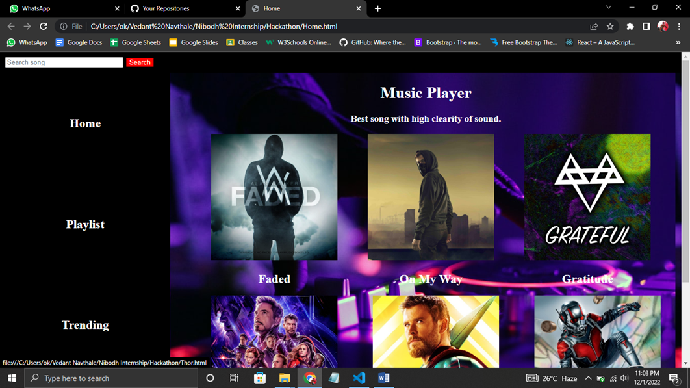

# Hackathon

> 2022 – Fifth project from my Nibodh internship

A **music player website** built using **HTML and CSS** featuring multiple pages like **Home, Trending, Playlist, and Favorites**.  
Users can browse and listen to any song of their choice through a simple static interface.

---

## 📘 Overview

This project focuses on building a multi-page static music player layout using only HTML and CSS, demonstrating page structuring, navigation, and responsive design basics.

---

## 🧰 Tech Stack

- **HTML5**
- **CSS3**

---

## 🚀 How to Run

1. Clone the repository  
```bash
git clone https://github.com/vednav9/nibodh-internship-hackathon.git
```
Open ```Home.html``` in your web browser.

## Preview

